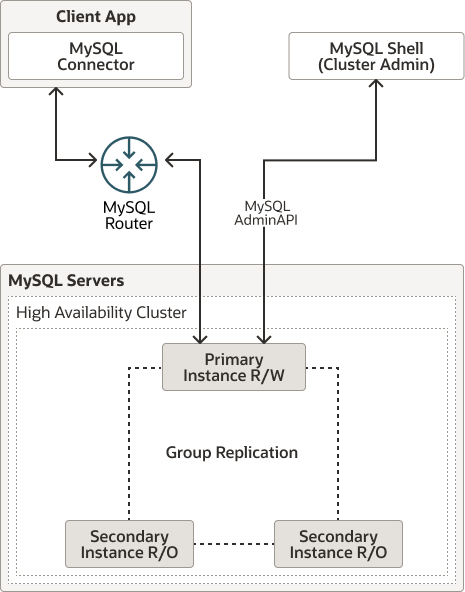

# 第7章 MySQL InnoDB 集群

**目录**

- [7.1 InnoDB 集群要求](./07.01.InnoDB 集群要求.md)
- [7.2 InnoDB 集群限制](./07.02.InnoDB 集群限制.md)
- [7.3 InnoDB 集群的用户账户](./07.03.InnoDB 集群的用户账户.md)
- [7.4 部署生产环境的InnoDB集群](./07.04.部署生产环境的InnoDB集群/07.04.00.部署生产环境的InnoDB集群.md)
- [7.5 配置InnoDB集群](./07.05.配置InnoDB集群/07.05.00.配置InnoDB集群.md)
- [7.6 保护InnoDB集群](./07.06.保护InnoDB集群.md)
- [7.7 监控InnoDB集群](./07.07.监控InnoDB集群.md)
- [7.8 恢复和重启InnoDB集群](./07.08.恢复和重启InnoDB集群/07.08.00.恢复和重启InnoDB集群.md)
- [7.9 修改或解散InnoDB集群](./07.09.修改或解散InnoDB集群.md)
- [7.10 升级InnoDB集群](./07.10.升级InnoDB集群/07.10.00.升级InnoDB集群.md)

MySQL InnoDB 集群提供了一个完整的MySQL高可用性解决方案。通过使用MySQL Shell附带的AdminAPI，您可以轻松地配置和管理至少三个MySQL服务器实例，使其作为InnoDB集群功能。

InnoDB集群中的每个MySQL服务器实例都运行MySQL Group Replication，它提供了在InnoDB集群内复制数据的机制，并具有内置故障转移功能。AdminAPI消除了在InnoDB集群中直接使用Group Replication的需求，但想要了解更多信息可以参见Group Replication，其中解释了详细信息。从MySQL 8.0.27开始，您还可以设置InnoDB ClusterSet（参见第8章，MySQL InnoDB ClusterSet），通过将主InnoDB集群与一个或多个自身的副本连接在不同位置，如不同的数据中心，为InnoDB集群部署提供灾难容忍能力。

MySQL Router可以根据您部署的集群自动配置自身，透明地将客户端应用程序连接到服务器实例。在服务器实例意外故障的情况下，集群会自动重新配置。在默认的单主模式下，InnoDB集群有一个单一的读写服务器实例 - 主实例。多个次要服务器实例是主实例的副本。如果主实例失败，次要实例会自动被提升为主角色。MySQL Router检测到这一点并将客户端应用程序转发到新的主实例。高级用户还可以配置集群以拥有多个主实例。

以下图表显示了这些技术如何协同工作的概览：

**图7.1 InnoDB集群概览**

三个MySQL服务器被组合成一个高可用性集群。其中一个服务器是读/写的主实例，其他两个是只读的次要实例。Group Replication用于将数据从主实例复制到次要实例。MySQL Router将客户端应用程序（在此示例中，一个MySQL Connector）连接到主实例。

> **重要**
>
> InnoDB集群不支持MySQL NDB集群。NDB集群依赖于NDB存储引擎以及一些特定于NDB集群的程序，这些程序在MySQL Server 8.0中并未提供；NDB只作为MySQL NDB集群发行版的一部分可用。此外，随MySQL Server 8.0提供的MySQL服务器二进制文件（mysqld）不能用于NDB集群。有关MySQL NDB集群的更多信息，请参见MySQL NDB集群8.0。《使用InnoDB的MySQL服务器与NDB集群相比》，提供了InnoDB和NDB存储引擎之间差异的信息。