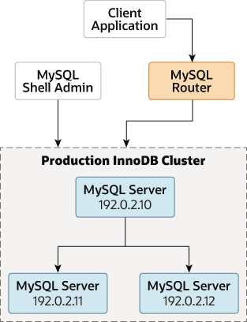

## 7.4 部署生产环境的InnoDB集群

- [7.4.1 InnoDB集群使用前的实例配置检查](./07.04.01.InnoDB集群使用前的实例配置检查.md)
- [7.4.2 为InnoDB集群使用配置生产实例](./07.04.02.为InnoDB集群使用配置生产实例.md)
- [7.4.3 创建一个InnoDB集群](./07.04.03.创建一个InnoDB集群.md)
- [7.4.4 向InnoDB集群添加实例](./07.04.04.向InnoDB集群添加实例.md)
- [7.4.5 配置InnoDB集群端口](./07.04.05.配置InnoDB集群端口.md)
- [7.4.6 在InnoDB集群中使用MySQL克隆](./07.04.06.在InnoDB集群中使用MySQL克隆/07.04.06.00.在InnoDB集群中使用MySQL克隆.md)
- [7.4.7 采用群组复制部署](./07.04.07.采用群组复制部署.md)

在生产环境中工作时，构成InnoDB集群的MySQL服务器实例运行在多台主机上，作为网络的一部分，而不是如第6.8节“AdminAPI MySQL沙箱”中所述运行在单一机器上。在继续这些指令之前，您必须将所需软件安装到每台您打算作为服务器实例加入集群的机器上，参见第6.2节“安装AdminAPI软件组件”。

下面的图表展示了您在本节中将要处理的场景：

**图7.2 生产部署**

三个MySQL服务器被组织成为一个生产InnoDB集群。其中一台服务器是主实例，另外两台是次级实例。主服务器的IP地址为139.59.177.10，两个次级实例的IP地址分别为139.59.177.11和139.59.177.12。MySQL路由器将客户端应用程序连接到主实例。MySQL Shell中的管理功能直接与生产InnoDB集群交互。

> **重要**
>
> 与沙箱部署不同，在沙箱部署中所有实例都部署在AdminAPI可以访问本地文件并且可以持久化配置更改的单一机器上，对于生产部署，您必须在实例上持久化任何配置更改。如何做到这一点取决于实例上运行的MySQL版本，参见第6.2.4节“持久化设置”。

要将服务器的连接信息传递给AdminAPI，使用类似URI的连接字符串或数据字典；参见使用类似URI的字符串或键值对连接到服务器。在这份文档中，展示的是类似URI的字符串。

本节假设您已经：

- 将MySQL组件安装到您的实例上
- 安装了MySQL Shell并能够通过指定实例连接
- 创建了合适的管理用户