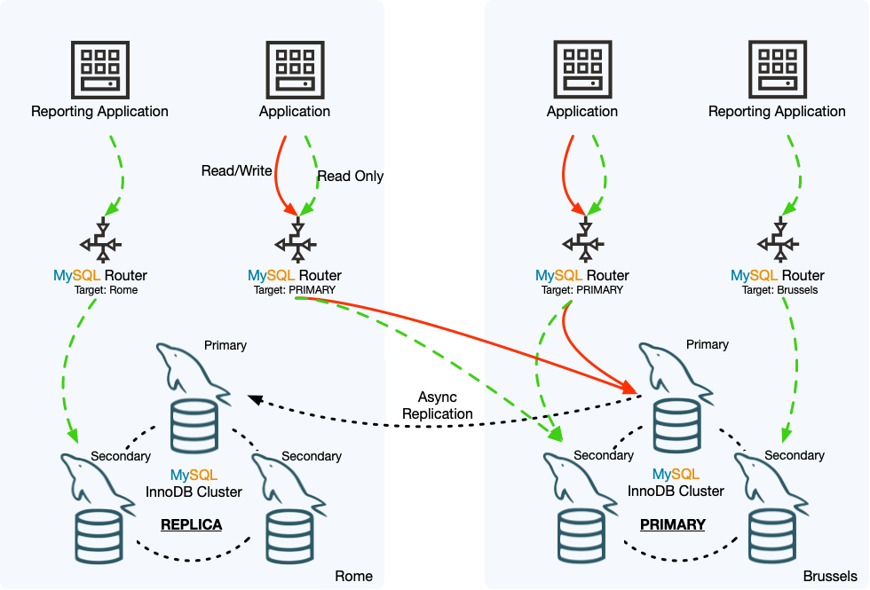

## 8.7 InnoDB ClusterSet 控制切换

控制切换将选定的副本集群变为 InnoDB ClusterSet 部署的主集群。在控制切换过程中，数据一致性得到保证。该过程验证选定的副本集群是否与主集群同步（这可能意味着如果存在复制延迟，则需要短暂等待），然后使该集群成为 InnoDB ClusterSet 的主集群。原主集群被降级为工作的只读副本集群。如果需要，您可以将原主集群离线，修复任何问题，并将其重新投入 InnoDB ClusterSet 部署的运行。

如果 InnoDB ClusterSet 部署中的主集群功能良好，但您需要进行维护或修复一些小问题以改善主集群的功能，那么请遵循控制切换程序。在 MySQL Shell 中使用 AdminAPI 的 `clusterSet.status()` 命令检查时，功能良好的主集群具有全局状态 `OK`。

如果 InnoDB ClusterSet 部署中的主集群功能不良好（具有全局状态 `NOT_OK`），请首先尝试使用 MySQL Shell 通过 AdminAPI 修复任何问题。例如，如果主集群丢失了法定人数，可以使用 `cluster.forceQuorumUsingPartitionOf` 命令恢复它。有关如何执行此操作的说明，请参见第 8.9 节“修复和重新加入 InnoDB ClusterSet”。

如果您无法通过处理主集群来解决问题（例如，因为您无法联系到它），则需要执行紧急故障转移。紧急故障转移旨在主集群突然不可用时进行灾难恢复。该程序存在丢失事务和为 InnoDB ClusterSet 创建分裂脑情况的风险。如果您确实需要进行紧急故障转移，请按照第 8.8 节“InnoDB ClusterSet 紧急故障转移”的程序确保风险得到管理。

下图显示了控制切换在一个示例 InnoDB ClusterSet 部署中的效果。罗马数据中心的主集群需要维护，因此进行了控制切换，使布鲁塞尔数据中心的副本集群成为 InnoDB ClusterSet 部署的主集群，并将罗马集群降级为副本。罗马集群上的 ClusterSet 复制通道已由控制切换过程激活，它正在从布鲁塞尔集群复制事务。现在罗马集群是副本集群，如果需要进行维护工作，可以安全地将成员服务器或完整集群离线。

**图 8.2 InnoDB ClusterSet 切换**



在示例 InnoDB 集群部署中，被设置为跟随主集群的 MySQL Router 实例已将读写流量路由至现在成为主集群的布鲁塞尔集群。当布鲁塞尔集群还是副本集群时，被设置为按名称路由读流量到布鲁塞尔集群的 MySQL Router 实例，继续将流量路由到它，并且不受集群现在是主集群而不是副本集群的事实的影响。同样，被设置为按名称路由读流量到罗马集群的 MySQL Router 实例可以继续这样做，因为副本集群仍接受读流量。

要对主 InnoDB 集群进行控制切换，请遵循以下程序：

1. 使用 MySQL Shell，使用 InnoDB 集群管理员账户（通过 `cluster.setupAdminAccount()` 创建）连接到主集群或任何一个副本集群中的任何成员服务器。您也可以使用具有所需权限的 InnoDB 集群服务器配置账户。使用 `dba.getClusterSet()` 或 `cluster.getClusterSet()` 命令获取 ClusterSet 对象。使用 InnoDB 集群管理员账户或服务器配置账户很重要，以确保存储在 ClusterSet 对象中的默认用户账户具有正确的权限。例如：

    ```mysql
    mysql-js> \connect admin2@127.0.0.1:3310
    Creating a session to 'admin2@127.0.0.1:3310'
    Please provide the password for 'admin2@127.0.0.1:3310': ********
    Save password for 'admin2@127.0.0.1:3310'? [Y]es/[N]o/Ne[v]er (default No):
    Fetching schema names for autocompletion... Press ^C to stop.
    Closing old connection...
    Your MySQL connection id is 52
    Server version: 8.0.27-commercial MySQL Enterprise Server - Commercial
    No default schema selected; type \use <schema> to set one.
    <ClassicSession:admin2@127.0.0.1:3310>
    mysql-js> myclusterset = dba.getClusterSet()
    <ClusterSet:testclusterset>
    ```

    在此示例中：

    - admin2@127.0.0.1:3310 是集群中任何在线成员服务器实例的 URI 格式连接字符串。

      该 URI 格式连接字符串由以下元素组成：

      - `admin2` 是 InnoDB 集群管理员账户的用户名。

      - `127.0.0.1:3310` 是成员服务器实例的主机和端口，如 `cluster.status()` 命令所显示。

    - 返回的 ClusterSet 对象被分配给变量 `myclusterset`。

2. 使用 MySQL Shell 中的 AdminAPI 的 `clusterSet.status()` 命令检查整个 InnoDB ClusterSet 部署的状态。使用 extended 选项查看部署中所有集群的详细信息，并检查是否有任何问题。例如：

    ```js
    mysql-js> myclusterset.status({extended: 1})
    ```

    有关输出的解释，请参见第 8.6 节，“InnoDB ClusterSet 状态和拓扑”。

3. 确定一个适合接管成为主集群的副本集群。副本集群是否有资格进行控制切换取决于 `clusterSet.status()` 命令报告的其全局状态。

    **表 8.1 按状态允许的集群操作**

    | InnoDB 集群全局状态 | 可路由                                                    | 控制切换 | 紧急故障转移 |
    | ------------------- | --------------------------------------------------------- | -------- | ------------ |
    | OK                  | 是                                                        | 是       | 是           |
    | OK_NOT_REPLICATING  | 是，如果通过名称指定为目标集群                            | 是       | 是           |
    | OK_NOT_CONSISTENT   | 是，如果通过名称指定为目标集群                            | 否       | 是           |
    | OK_MISCONFIGURED    | 是                                                        | 是       | 是           |
    | NOT_OK              | 否                                                        | 否       | 否           |
    | INVALIDATED         | 是，如果通过名称指定为目标集群且设置了 accept_ro 路由策略 | 否       | 否           |
    | UNKNOWN             | 连接的 MySQL Router 实例可能仍在将流量路由到集群          | 否       | 否           |

    具有全局状态 OK_NOT_CONSISTENT 的副本集群在集群上有一组事务（GTID 集），与主集群上的 GTID 集不一致。InnoDB ClusterSet 不允许对此状态下的集群进行控制切换，因为客户端会访问到错误的数据。如果集群拥有可用选项中最新的事务集，可能进行紧急故障转移。

4. 检查为每个 MySQL Router 实例设置的路由选项以及 InnoDB ClusterSet 部署的全局策略，通过在连接到 InnoDB ClusterSet 部署中的任何成员服务器时发出 `clusterSet.routingOptions()` 命令。例如：

    ```js
    mysql-js> myclusterset.routingOptions()
    {
        "domainName": "testclusterset",
        "global": {
            "invalidated_cluster_policy": "drop_all",
            "target_cluster": "primary"
        },
        "routers": {
            "Rome1":  {
                "target_cluster": "primary"
            },
            "Rome2": {}
        }
    }
    ```

    默认情况下，MySQL Router 实例将流量发送到当前在 InnoDB ClusterSet 部署中的主集群。如果所有 MySQL Router 实例都设置为跟随主集群（`"target_cluster": "primary"`），则在切换后的几秒钟内流量将自动重定向到新的主集群。

    如果任何实例被设置为按名称针对当前主集群（`"target_cluster": "name_of_primary_cluster"`），它们将不会将流量重定向到新的主集群。在这种情况下，如果适合应用程序，您可以使用 `clusterSet.setRoutingOption()` 命令更改这些实例的路由策略。您可以更改这些实例以跟随主集群（`"target_cluster": "primary"`），在这种情况下，现在可以设置该选项。例如：
    ```js
    mysql-js> myclusterset.setRoutingOption('Rome1', 'target_cluster', 'primary')
    Routing option 'target_cluster' successfully updated in router 'Rome1'.
    ```

5. 发出 `clusterSet.setPrimaryCluster()` 命令，命名将接管成为新主集群的副本集群。使用您使用 InnoDB 集群管理员账户获取的 ClusterSet 对象，通过 `dba.getClusterSet()` 或 `cluster.getClusterSet()` 命令。例如：

    ```mysql-js
    mysql-js> myclusterset.setPrimaryCluster('clustertwo')
    Switching the primary cluster of the clusterset to 'clustertwo'
    * Verifying clusterset status
    ** Checking cluster clustertwo
      Cluster 'clustertwo' is available
    ** Checking cluster clusterone
      Cluster 'clusterone' is available
    
    * Refreshing replication account of demoted cluster
    * Synchronizing transaction backlog at 127.0.0.1:4410
    ** Transactions replicated  ############################################################  100%
    * Updating metadata
    
    * Updating topology
    ** Changing replication source of 127.0.0.1:3330 to 127.0.0.1:4410
    * Acquiring locks in replicaset instances
    ** Pre-synchronizing SECONDARIES
    ** Acquiring global lock at PRIMARY
    ** Acquiring global lock at SECONDARIES
    
    * Synchronizing remaining transactions at promoted primary
    ** Transactions replicated  ############################################################  100%
    * Updating replica clusters
    Cluster 'clustertwo' was promoted to PRIMARY of the clusterset. The PRIMARY instance is '127.0.0.1:4410'
    ```

    对于 `clusterSet.setPrimaryCluster()` 命令：

    - `clusterName` 参数是必需的，指定了 InnoDB ClusterSet 中副本集群的标识符，如 `clusterSet.status()` 命令的输出中给出的。在示例中，`clustertwo` 是将成为新主集群的集群。
    - 如果您希望进行验证并记录更改而不实际执行它们，请使用 `dryRun` 选项。
    - 使用 `timeout` 选项设置在切换发生之前等待副本集群与主集群同步的最大秒数。如果超时过期，切换将被取消。
    - 使用 `invalidateReplicaClusters` 选项命名任何无法到达或不可用的副本集群。这些将在切换过程中被标记为无效。如果在过程中发现您没有命名的任何无法到达或不可用的副本集群，切换将被取消。在这种情况下，您必须先修复并重新加入副本集群然后重试命令，或者在重试命令时使用此选项命名它们，并稍后修复它们。

    当您执行 `clusterSet.setPrimaryCluster()` 命令时，MySQL Shell 会检查目标副本集群是否符合成为主集群的要求，并在不符合要求时返回错误。如果目标副本集群满足要求，MySQL Shell 将执行以下任务：

    - 检查是否有任何未使用 `invalidateReplicaClusters` 指定的不可达或不可用的副本集群。
    - 等待目标副本集群通过应用来自当前主集群的任何未完成的事务与当前主集群同步。如果通过 `timeout` 选项设置的超时时间到期之前副本集群未完成应用事务，切换操作将被取消。
    - 通过执行 `FLUSH TABLES WITH READ LOCK` 语句并在所有成员服务器上设置 `super_read_only` 系统变量来锁定当前的主集群，以防止切换期间进一步的更改。`Group Replication` 成员操作 `mysql_disable_super_read_only_if_primary` 被禁用，以便在故障转移后保持 `super_read_only` 设置。
    - 协调当前主集群与副本集群之间视图更改事件的差异，使 GTID 集相同。这些 `Group Replication` 内部事务由 `group_replication_view_change_uuid` 系统变量指定的 UUID 标识。MySQL Shell 在所有副本集群上注入空事务，以匹配主集群上的视图更改事件。
    - 在所有副本集群上更新 `ClusterSet` 复制通道，以从目标集群作为新的主集群进行复制。
    - 在目标集群的主服务器上禁用 `super_read_only`，并启用 `Group Replication` 成员操作 `mysql_disable_super_read_only_if_primary`，以处理对该集群主服务器的任何更改。
    - 在旧主集群的主服务器上禁用 `Group Replication` 成员操作 `mysql_disable_super_read_only_if_primary`，使其保持只读状态，并在该服务器上启用 `Group Replication` 成员操作 `mysql_start_failover_channels_if_primary`，以启用 `ClusterSet` 复制通道上的副本的异步连接故障转移。
    - 将目标集群设置为 `ClusterSet` 元数据中的主集群，并将旧的主集群更改为副本集群。

6. 再次使用 `clusterSet.status()` 命令并使用 extended 选项，来验证 InnoDB ClusterSet 部署的状态。

7. 如果您有任何 MySQL Router 实例需要切换以针对新的主集群，请现在执行。例如：

    ```js
    mysql-js> myclusterset.setRoutingOption('Rome1', 'target_cluster', 'clustertwo')
    Routing option 'target_cluster' successfully updated in router 'Rome1'.
    ```

    在这个示例中，`myclusterset` 是 ClusterSet 对象的变量，`Rome1` 是 MySQL Router 实例的名称，而 `clustertwo` 是目标集群的名称。完成后，发出 `clusterSet.routingOptions()` 命令来检查所有 MySQL Router 实例是否现在都正确地路由了。

8. 现在您可以处理旧的主集群来修复问题或进行维护。如果您在切换过程中不得不使任何副本集群无效，您也可以修复这些并将它们重新加入到 InnoDB ClusterSet。第 8.9 节，“InnoDB ClusterSet 修复和重新加入”解释了如何修复集群的问题、如何将集群重新加入到 InnoDB ClusterSet 以及如何再次将集群变为主集群。