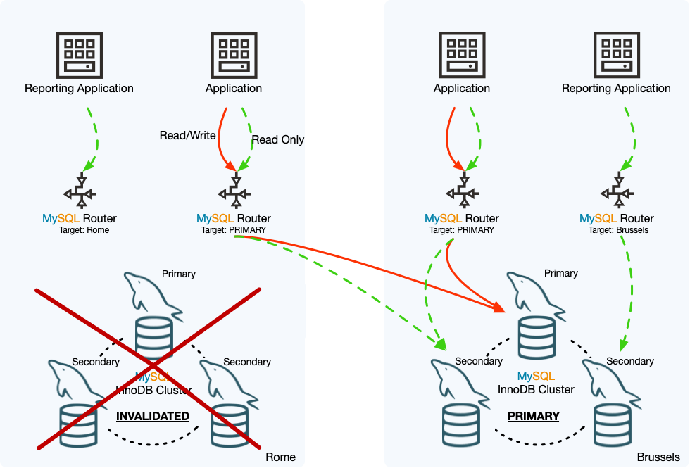

## 8.8 InnoDB ClusterSet 紧急故障转移

紧急故障转移将选择的副本集群变为 InnoDB ClusterSet 部署的主 InnoDB 集群。当当前的主集群无法工作或无法联系时，可以使用此程序。在紧急故障转移过程中，数据一致性无法保证，因此为了安全，原始的主集群在故障转移过程中被标记为无效。如果原始的主集群仍在线，应在可以联系到它时尽快将其关闭。之后，如果您能够解决问题，可以修复并重新将无效的主集群加入 InnoDB ClusterSet 拓扑。

当 InnoDB ClusterSet 部署中的主 InnoDB 集群出现问题或您无法访问时，不要立即执行紧急故障转移至副本集群。相反，您应该始终首先尝试修复当前活动的主集群。

> **重要提示**
>
> 为什么不直接故障转移？InnoDB ClusterSet 拓扑中的副本集群尽最大努力保持与主集群的同步。然而，根据交易量和主集群与副本集群之间的网络连接的速度和容量，副本集群在接收交易和将更改应用到其数据上方面可能落后于主集群。这称为复制延迟。在大多数复制拓扑中，某些复制延迟是预期中的，尤其是在集群地理分散并位于不同数据中心的 InnoDB ClusterSet 部署中。
>
> 此外，主集群可能因网络分区从 InnoDB ClusterSet 拓扑的其他元素断开，但仍保持在线。如果发生这种情况，一些副本集群可能会与主集群保持连接，一些实例和客户端应用可能继续连接到主集群并应用交易。在这种情况下，InnoDB ClusterSet 拓扑的分区区域开始相互分离，每组服务器上的交易集不同。
>
> 当存在复制延迟或网络分区时，如果您触发紧急故障转移至副本集群，主集群上的任何未复制或分歧交易都有丢失的风险。在网络分区的情况下，故障转移可能导致拆分脑情况，其中拓扑的不同部分具有分歧的交易集。因此，您应该总是尝试修复或重新连接主集群，然后才触发紧急故障转移。如果主集群无法足够快地修复或无法联系到，您可以继续进行紧急故障转移。

此图展示了示例 InnoDB ClusterSet 部署中紧急故障转移的效果。罗马数据中心的主集群已离线，因此进行了紧急故障转移，使布鲁塞尔数据中心的副本集群成为 InnoDB ClusterSet 部署的主 InnoDB 集群。罗马集群已被标记为无效，并且在 InnoDB ClusterSet 部署中的状态已被降级为副本集群，尽管它目前无法从布鲁塞尔集群复制交易。

**图8.3 InnoDB ClusterSet故障转移**



被设置为跟随主集群的 MySQL Router 实例已将读写流量路由至现在是主集群的布鲁塞尔集群。当布鲁塞尔集群还是副本集群时，定位布鲁塞尔集群读流量的 MySQL Router 实例，继续将流量路由至该集群，并且不受该集群现在是主集群而不是副本集群的事实影响。然而，定位罗马集群读流量的 MySQL Router 实例当前无法将任何流量发送到那里。在此示例中，当本地数据中心离线时，报告应用不需要报告，但如果应用仍需要运行，应该将 MySQL Router 实例的路由选项更改为跟随主集群或将流量发送至布鲁塞尔集群。

执行主 InnoDB 集群的紧急故障转移时，请按照以下程序操作：

1. 使用 MySQL Shell，使用 InnoDB 集群管理员账户（使用 `cluster.setupAdminAccount()` 创建）连接到 InnoDB ClusterSet 部署中仍然活跃的任何成员服务器。您也可以使用 InnoDB 集群服务器配置账户，这同样具有所需的权限。

   建立连接后，使用 `dba.getClusterSet()` 或 `cluster.getClusterSet()` 命令从该成员服务器获取 ClusterSet 对象。之前从现在已离线的成员服务器检索的 ClusterSet 对象将不再有效，因此您需要再次从在线的服务器获取它。使用 InnoDB 集群管理员账户或服务器配置账户很重要，以便存储在 ClusterSet 对象中的默认用户账户具有正确的权限。例如：

   ```mysql
   mysql-js> \connect admin2@127.0.0.1:4410
   Creating a session to 'admin2@127.0.0.1:4410'
   Please provide the password for 'admin2@127.0.0.1:4410': ********
   Save password for 'admin2@127.0.0.1:4410'? [Y]es/[N]o/Ne[v]er (default No):
   Fetching schema names for autocompletion... Press ^C to stop.
   Closing old connection...
   Your MySQL connection id is 71
   Server version: 8.0.27-commercial MySQL Enterprise Server - Commercial
   No default schema selected; type \use <schema> to set one.
   <ClassicSession:admin2@127.0.0.1:4410>
   
   mysql-js> myclusterset = dba.getClusterSet()
   <ClusterSet:testclusterset>
   ```

2. 使用 MySQL Shell 中的 AdminAPI 的 `clusterSet.status()` 函数检查整个部署的状态。使用 `extended` 选项精确查看问题所在及其性质。例如：

    ```mysql
    mysql-js> myclusterset.status({extended: 1})
    ```

    有关输出的解释，请参阅 8.6 节，“InnoDB ClusterSet 状态和拓扑”。

3. InnoDB 集群可以容忍一些问题并足以继续作为 InnoDB ClusterSet 部署的一部分运行。使用 `clusterSet.status()` 命令检查时，功能正常的主集群具有全局状态 OK。例如，如果集群中的一个成员服务器离线，即使该服务器是主服务器，底层的 Group Replication 技术也可以处理这种情况并重新配置自己

   如果主集群在 InnoDB ClusterSet 部署中的报告状态显示功能正常（全局状态为 OK），但您需要进行维护或修复一些小问题以改善主集群的功能，您可以执行控制转移至副本集群。然后，如果需要，您可以将主集群脱机，修复任何问题，并将其重新投入 InnoDB ClusterSet 部署。有关此操作的说明，请参阅 8.7 节，“InnoDB ClusterSet 控制转移”。

4. 如果主集群在 InnoDB ClusterSet 部署中不正常运行（全局状态为 NOT_OK），但您可以联系到它，首先尝试使用 MySQL Shell 通过 AdminAPI 修复任何问题。例如，如果主集群丢失了法定人数，可以使用 `cluster.forceQuorumUsingPartitionOf` 命令恢复它。有关如何操作的说明，请参阅 8.9 节，“InnoDB ClusterSet 修复和重新加入”。

5. 如果您无法进行控制转移，并且无法通过与主集群的工作迅速解决问题（例如，因为您无法联系到它），继续执行紧急故障转移。首先确定一个合适的副本集群，可以接管成为新的主集群。副本集群是否适合紧急故障转移取决于其在 `clusterSet.status()` 命令报告的全局状态：

   **表格8.2 根据状态允许的集群操作**

    | InnoDB 集群在 ClusterSet 中的全局状态 | 可路由                                                      | 控制转移 | 紧急故障转移 |
    | ------------------------------------- | ----------------------------------------------------------- | -------- | ------------ |
    | OK                                    | 是                                                          | 是       | 是           |
    | OK_NOT_REPLICATING                    | 是（如果按名称指定为目标集群）                              | 是       | 是           |
    | OK_NOT_CONSISTENT                     | 是（如果按名称指定为目标集群）                              | 否       | 是           |
    | OK_MISCONFIGURED                      | 是                                                          | 是       | 是           |
    | NOT_OK                                | 否                                                          | 否       | 否           |
    | INVALIDATED                           | 是（如果按名称指定为目标集群并且设置了 accept_ro 路由策略） | 否       | 否           |
    | UNKNOWN                               | 连接的 Router 实例可能仍在将流量路由到集群                  | 否       | 否           |

   您选择的副本集群必须在所有可达的副本集群中具有最新的交易集（GTID 集）。如果有多个副本集群符合紧急故障转移条件，请检查每个集群的复制延迟（在 `clusterSet.status()` 命令的扩展输出中显示）。选择复制延迟最小的副本集群，因此应该具有最多的交易。紧急故障转移过程会检查所有当前可达的副本集群的 GTID 集，并告诉您如果另一个集群更新，因此您可以再次尝试使用那个集群。

6. 使用 MySQL Shell 连接到 InnoDB ClusterSet 部署中的任何成员服务器时，发出 `clusterSet.routingOptions()` 命令，检查为每个 MySQL Router 实例设置的路由选项以及 InnoDB ClusterSet 部署的全局策略。例如：

    ```mysql
    mysql-js> myclusterset.routingOptions()
    {
        "domainName": "testclusterset",
        "global": {
            "invalidated_cluster_policy": "drop_all",
            "target_cluster": "primary"
        },
        "routers": {
            "Rome1":  {
                "target_cluster": "primary"
            },
            "Rome2": {}
        }
    }
    ```

    如果所有 MySQL Router 实例都设置为跟随主集群（"target_cluster": "primary"），则故障转移后几秒钟内流量将自动重定向到新的主集群。如果一个 MySQL Router 实例没有显示路由选项，如上面 "target_cluster" 为 Rome2的示例，这意味着该实例没有设置该策略，它遵循全球策略。

    如果任何实例被设置为按名称定位当前的主集群（"target_cluster": "name_of_primary_cluster"），它们将不会将流量重定向到新的主集. 当主集群不正常运行时，`clusterSet.setRoutingOption()` 命令无法用于更改路由选项，因此在新的主集群完成故障转移之前，您无法重定向由该 MySQL Router 实例处理的流量。

7. 如果可以，请尝试验证原始主集群是否已离线，如果它在线，请尝试将其关闭。如果它保持在线并继续接收来自客户端的流量，可能会创建一个分离的情况，其中 ClusterSet 的分离部分发生分歧。

8. 要继续执行紧急故障转移，请发出 `clusterSet.forcePrimaryCluster()` 命令，命名将接管成为新主集群的副本集群。例如：

   ```js
   mysql-js> myclusterset.forcePrimaryCluster("clustertwo")
   Failing-over primary cluster of the clusterset to 'clustertwo'
   * Verifying primary cluster status
   None of the instances of the PRIMARY cluster 'clusterone' could be reached.
   * Verifying clusterset status
   ** Checking cluster clustertwo
     Cluster 'clustertwo' is available
   ** Checking whether target cluster has the most recent GTID set
   * Promoting cluster 'clustertwo'
   * Updating metadata
   
   PRIMARY cluster failed-over to 'clustertwo'. The PRIMARY instance is '127.0.0.1:4410'
   Former PRIMARY cluster was INVALIDATED, transactions that were not yet replicated may be lost.
   ```

   在 `clusterSet.forcePrimaryCluster()` 命令中：

   - `clusterName` 参数是必需的，它指定了 InnoDB ClusterSet 中副本集群的标识符，如 `clusterSet.status()` 命令的输出中所示。在示例中，clustertwo 是将成为新主集群的集群。

   - 如果您想进行验证并记录更改而不实际执行它们，请使用 `dryRun` 选项。

   - 使用 `invalidateReplicaClusters` 选项命名任何无法到达或不可用的副本集群。在故障转移过程中，这些将被标记为无效。如果在过程中发现您没有命名的任何无法到达或不可用的副本集群，故障转移将被取消。在这种情况下，您必须要么修复并重新加入副本集群然后重试命令，要么在您重试命令时使用此选项命名它们，之后再修复它们。

   - 使用 `timeout` 选项定义在集群的每个实例中应用挂起交易的最大等待秒数。确保 `GTID_EXECUTED` 具有最新的 GTID 集。默认值从 `dba.gtidWaitTimeout` 选项获取。


   发出 `clusterSet.forcePrimaryCluster()` 命令时，MySQL Shell 检查目标副本集群是否符合接管成为主集群的要求，并在不符合时返回错误。

   如果目标副本集群符合要求，MySQL Shell 将执行以下任务：

     - 尝试联系当前的主集群，如果实际上可以联系到，则停止故障转移。

     - 检查使用 `invalidateReplicaClusters` 未指定的任何无法到达或不可用的副本集群，并在发现任何此类集群时停止故障转移。

     - 将 `invalidateReplicaClusters` 中列出的所有副本集群标记为无效，并将旧的主集群标记为无效。

   - 检查目标副本集群是否在所有可用的副本集群中具有最新的 GTID 集。这涉及停止所有副本集群中的 ClusterSet 复制通道。

   - 更新所有副本集群上的 ClusterSet 复制通道，以从目标集群作为新的主集群进行复制。

   - 将目标集群设置为 ClusterSet 元数据中的主集群，并将旧的主集群更改为副本集群，尽管它目前因为被标记为无效而无法作为副本集群运行。


   在紧急故障转移期间，MySQL Shell 不尝试将目标副本集群与当前的主集群同步，也不锁定当前的主集群。如果原始的主集群仍然在线，应尽快联系到它并将其关闭。

9. 如果您有任何 MySQL Router 实例需要切换到定位新的主集群，请现在进行。您可以将它们更改为跟随主集群（"target_cluster": "primary"），或指定接管的副本集群作为主集群（"target_cluster": "name_of_new_primary_cluster"）。例如：

   ```mysql
   mysql-js> myclusterset.setRoutingOption('Rome1', 'target_cluster', 'primary')
   or
   mysql-js> myclusterset.setRoutingOption('Rome1', 'target_cluster', 'clustertwo')
   Routing option 'target_cluster' successfully updated in router 'Rome1'.
   ```

   发出 `clusterSet.routingOptions()` 命令以检查所有 MySQL Router 实例现在是否正确路由。

10. 再次使用 `extended` 选项发出 `clusterSet.status()` 命令，以验证 InnoDB ClusterSet 部署的状态。

11. 如果您能够再次联系到旧的主集群，首先确保没有应用流量被路由到它，并将其脱机。然后，遵循第 8.9 节，“InnoDB ClusterSet 修复和重新加入”中的过程，检查交易并决定如何安排 InnoDB ClusterSet 拓扑向前发展。
12. 紧急故障转移之后，如果 ClusterSet 的不同部分之间存在交易集差异的风险，您必须将集群从写入流量或所有流量中隔离。有关更多详细信息，请参阅 InnoDB ClusterSet 中的集群隔离。
13. 如果您在故障转移过程中不得不使任何副本集群无效，如果并且当您再次能够联系到它们时，您可以使用第 8.9 节，“InnoDB ClusterSet 修复和重新加入”中的过程修复它们并将它们重新加入 InnoDB ClusterSet。