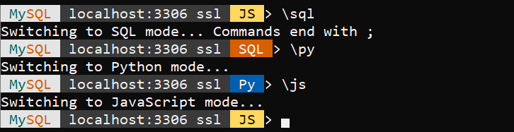

## 13.3 自定义提示符

MySQL Shell的提示符可以使用提示主题文件进行自定义。要自定义提示主题文件，可以将`MYSQLSH_PROMPT_THEME`环境变量设置为提示主题文件的名称，或者将一个提示主题文件复制到Linux和macOS上的`~/.mysqlsh/`目录，或Windows上的`%AppData%\Roaming\MySQL\mysqlsh\`目录。文件必须命名为`prompt.json`，并且在更改生效前必须重启MySQL Shell。

图13.1 mysql shell提示符


MySQL Shell提示符显示输入语言从JavaScript变为SQL，从SQL变为Python，然后从Python回到JavaScript的变化。

提示符由六个部分组成：

- 状态：是否为生产系统以及是否失去了连接。
- MySQL：提醒您正在使用MySQL数据库。
- 连接：您连接到哪个主机，使用的是哪个端口，以及是否使用了SSL。
- 架构：当前的默认架构。
- 模式：您正在使用的模式：JS = JavaScript，PY = Python，和SQL = SQL。
- 结束：提示符以`>`结束。

mysqlsh目录的用户配置路径，其中包含`prompt.json`，可以通过定义环境变量`MYSQLSH_USER_CONFIG_HOME`在所有平台上覆盖。这个变量的值替换了Microsoft Windows上的`%AppData%\Roaming\MySQL\mysqlsh\`或Unix上的`~/.mysqlsh/`。

在Microsoft Windows上，在以下目录找到提示主题文件：`%programfiles%\MySQL\MySQL Shell 8.0\share\mysqlsh\prompt\`。

在macOS上，在以下目录找到提示主题文件：`/usr/local/mysql-shell/share/mysqlsh/prompt`。

在Linux上，在以下目录找到提示主题文件：`/usr/share/mysqlsh/prompt/`。

提示主题文件的格式在`README.prompt`文件中有描述。还包括一些示例提示主题文件，例如，`prompt_256.json`：

在示例提示主题`prompt_256.json`中，有一个包含`disconnected%host%`和`%is_production%`类的对象。变量在此文件中定义或来自MySQL Shell本身，例如，`%host`和`%port`。在这个示例中，主机包含在环境变量`PRODUCTION_SERVERS`中。

```json
"variables" : {
    "is_production": {
    "match" : {
    "pattern": "*;%host%;*",
    "value": ";%env:PRODUCTION_SERVERS%;"
    },
```

背景色和前景色使用`bg`和`fg`元素定义。这些元素允许您自定义提示符中使用的颜色。指定颜色的方法有以下几种：

- 通过名称：使用名称定义的颜色。
- 通过索引：使用0到255（含）之间的值，其中0是黑色，63是浅蓝色，127是品红色，193是黄色，255是白色。
- 通过RGB：使用`#rrggbb`格式的值。终端必须支持TrueColor。

此示例中使用了命名颜色，如果布尔`is_production`元素返回TRUE，则输出文本`PRODUCTION`。

```json
"production" : {
"text": " PRODUCTION ",
"bg": "red",
"fg": "white"
}
```

这些元素以以下格式输出提示符：

图13.2 mysql shell提示符



使用`prompt_256.json`文件自定义的提示符。

颜色显示取决于终端的支持情况。大多数Linux和Mac的终端支持256种颜色。在Windows上，颜色支持需要第三方终端程序支持ANSI/VT100转义序列，或Windows 10。默认情况下，MySQL Shell尝试检测终端类型并适当处理颜色。如果自动检测不适用于您的终端类型，或者如果您想由于可访问性需求或其他目的修改颜色模式，可以定义环境变量`MYSQLSH_TERM_COLOR_MODE`，强制MySQL Shell使用特定的颜色模式。这个环境变量的可能值有rgb、256、16和nocolor。

如果在启动时发现提示主题文件中有错误，将打印一条错误信息并使用默认提示主题。一些示例提示主题文件需要特殊字体（例如SourceCodePro+Powerline+Awesome+Regular.ttf）。如果您将`MYSQLSH_PROMPT_THEME`环境变量设置为一个空值，MySQL Shell将使用没有颜色的最小提示符。